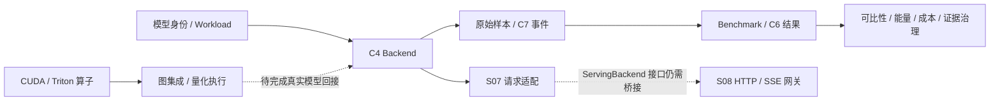

# HeteroQuantServeBench

HQSB 是面向 NVIDIA CUDA 与 Ascend/CANN 的推理优化实验项目：从模型基线和 profiling，追踪算子、量化、Runtime、Serving 到跨硬件评估的证据链。

**当前状态：可运行的 CUDA/模型基线 + 多阶段契约与研究脚手架，尚未完成 S00–S15 全部实验验收。** 后期模块中的 `smoke`、接口解析通过、配置审计通过，均不代表模型级优化或生产部署已验证。S03/S04 的部分原始实验还有 FAIL，S04.5 未闭环，S05-02/03/04 仍为 BLOCKED。

- [项目现状总览](docs/project_status.md)：逐阶段状态、已修复问题、剩余缺口。
- [使用说明书](docs/manual/使用说明书.md)：环境、入口、数据流、常用操作、扩展方式。
- [逐文件/API 索引](docs/manual/generated/README.md)：源码、脚本、配置、测试、文档的作用、接口、依赖和调用者。
- [全仓库审查报告](docs/audit/全项目审查报告_20260920.md)：发现依据、修改边界和测试证据。
- [独立功能测试报告](docs/audit/全项目功能测试报告_20260920.md)：新增 36 条用例的场景、预期/实际结果，完整回归与真实模型 smoke。
- [阶段设计](docs/stages/) / [模块边界](docs/architecture/module_ownership.md)：设计目标与依赖规则。

## 本项目的执行方式

Mac 用于编辑和版本管理；运行、构建、测试与硬件探测全部通过 Jetson 代理。下列命令在 **Mac 项目根目录**输入：

```bash
# 同步预览，然后同步源码；不覆盖远端 raw、模型或 build
./scripts/sync_to_jetson.sh --dry-run
./scripts/sync_to_jetson.sh

# 软件回归：保存命令、源码哈希、pytest XML、原始日志和 summary
./scripts/remote_run.sh python3 scripts/audit/run_project_audit.py

# 验证不含私有实验数据的新检出也能通过
./scripts/remote_run.sh python3 scripts/audit/run_project_audit.py --clean-source

# 本轮临时工具环境中的 Ruff；公共文档链接
./scripts/remote_run.sh env PYTHONPATH=/tmp/hqsb-audit-tools \
  python3 -m ruff check hqsb ops scripts tests benchmarks
./scripts/remote_run.sh python3 scripts/check_docs.py
```

默认远端为 `jetson@192.168.10.7:/home/jetson/work/HeteroQuantServeBench`。`HQSB_REMOTE_HOST`、`HQSB_REMOTE_DIR` 可统一覆盖运行、同步和拉取目标。自动保存不等同于已验证同步。

CPU 回归表示“不使用加速器”，并不表示“只安装 core 就能跑所有测试”：部分测试需要 CPU 可用的 torch 等 benchmark 依赖。Jetson 必须保留 NVIDIA 提供的 torch wheel，勿直接用普通 PyPI torch 替换。首次安装、CUDA 构建和模型运行见使用说明书。

## 主要工作流



`hqsb/` 是 Python 库；`ops/` 是算子与硬件调用层；`scripts/` 是操作/实验入口；`configs/` 是配置和冻结词汇表；`tests/` 是软件验证；`docs/stage_experiments/` 是被 Git 忽略的本机实验档案。完整源码检出不会自动获得这些私有原始证据。

项目原则：先 profiling，再优化；先 correctness，再性能；先证据，再声明。没有测量就保留缺失状态，不用模拟数字代替硬件收益。

## Web Console

`web/console/` 提供浏览器推理工作台，`hqsb/console/` 提供认证、真实流式推理、取消、任务持久化与历史证据 API。默认通过远端 Jetson 上的 Qwen3 FP16 Reference 运行；未验证的量化与自定义算子模型回接不会在页面中假装可用。

Console v0.2 增加阶段与逐 token 观测、有限窗口 CPU/CUDA profiler、trace 查询/下载、内存归因与张量账本、历史 kernel 证据钻取，以及真实 RTN-W4/W8 制品任务。量化制品与在线低比特部署分开，优化导出保留为待验证假设。测试范围见 [v0.2 验收报告](docs/audit/HQSB_Console_v0.2_验收报告_20260921.md)。

v0.2.1 新增侧栏「内存与数据流」：共享 DRAM 与 allocator 结构、可点击权重矩形图、逐层 KV 图、请求流程与实际 CUDA copy 方向。默认回放已有真实采集，模型卸载后仍可查看绑定加载记录；显式 memcpy 字节不等于全部内存读写。验证见 [可视化验收报告](docs/audit/HQSB_Console_v0.2.1_可视化验收报告_20260921.md)。

启动与开发见 [Console 入口说明](web/console/README.md)，逐页操作与指标口径见 [前端使用说明书](docs/manual/前端使用说明书.md)。Console 使用独立版本的交互计时，不改变既有 C4/C6/C7 基准契约。
