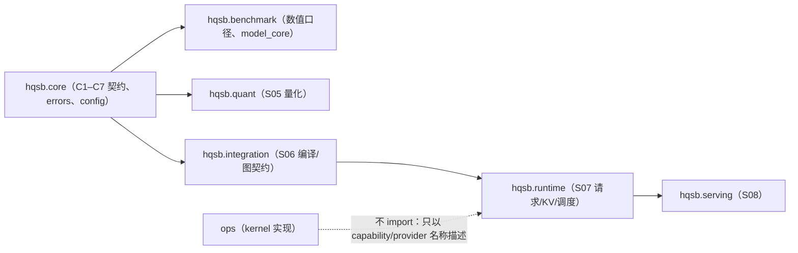

# S07 推理 Runtime 内核：Runtime Architecture / Design 制品

> 本文件是 S07 的 **Design 制品**（控制平面 §26.1 第 1 类）与 §16.3/§26.2 命名的
> **runtime architecture** 报告。它描述**接口层**已建成的 Runtime 结构：职责边界、
> 请求状态机、KV/调度/前缀/图模型、数据布局与阶段边界。
>
> **成熟度：M2**（源码 + 本树自动化测试）。控制平面 §16.3 要求的 **M5**
> （端到端收益）**未主张**：那需要真实 runtime 与硬件运行证据。
> **本文件不含任何实验结论数字**；实验层判定见
> [`S07_阶段验收报告.md`](S07_阶段验收报告.md)（当前 `BLOCKED`），
> 每阶段六类固定制品的交付状态见该报告 §1.1。
>
> 依据：`docs/stages/S07_推理Runtime内核.md`、
> `docs/stage_experiments/S07_实验清单.md`、
> `docs/stage_experiments/details/S07/**`（E07-01 ~ E07-10）、
> `docs/stage_experiments/README.md`（手册 §4/§5/§6）。

## 1. 分层与依赖方向

S07 落在 `hqsb/runtime/`（新区域）。依赖方向（`docs/architecture/module_ownership.md`
v1.2.0，gate 规则 R3/R4）：



三条硬约束（有测试与 gate 双保险）：

1. `core`/`models`/`benchmark`/`backends`/`hardware`/`quant`/`integration` **不得**
   import `hqsb.runtime`（R3）；
2. `hqsb.runtime` **不得** import `ops`，kernel 只以 capability/provider 名称出现（R4）；
3. 包内**不得**在模块级 import `torch`/`triton`/`numpy`：重引擎一律函数内惰性探测，
   缺失时给出结构化 `CapabilityError` 而不是 `ImportError`。

## 2. 请求执行链与状态机

统一抽象（`hqsb/runtime/trace.py`）：

```
CREATED → VALIDATED → WAITING → ADMITTED → PREFILLING → DECODING → FINISHED → CLEANED
分支：PREEMPTED / RESUMED、CANCEL_REQUESTED / CANCELLED、TIMED_OUT、FAILED、REJECTED
```

- 每次转换记录 request_id、old/new、时间戳、scheduler iteration、reason、token 计数、
  KV block/refcount、batch、model runner span、error、cleanup；
- 终态检查会拒绝「取消后重新 admit」与「非终态收尾」；
- C7 span 层级（`telemetry.SPAN_CHAIN`）与 details README §16 一致：
  `request → scheduler_wait → scheduler_iteration → kv_lookup_allocate_free →
  prepare_batch → model_runner → attention → mlp_custom_quant → sample →
  emit_token → cleanup`，`request_id` 显式传参（禁止 thread-local 猜请求）。

## 3. KV 模型

三层分离（`hqsb/runtime/kv.py`）：

| 层 | 内容 | 关键契约 |
|---|---|---|
| 几何 | `KVGeometry`、`blocks_for`、`block_boundary_points` | `bytes_per_token = 2×L×H_kv×D_h×element_bytes (+量化侧数据)`；`blocks = ceil(tokens/P)` |
| 生命周期 | `BlockPool`、`BlockState`、`ALLOWED_BLOCK_TRANSITIONS` | free 无 live owner；写前分配；free 后不访问；evict 不碰 active/shared；refcount 与 readers 一致 |
| 记账 | `MemoryReconciliation`、`FRAGMENT_CLASSES` | 每个字节必须落在**命名类别**；残差非零即 `explained=False`，不允许叫「碎片」 |

容量与失败政策同样是显式契约：`KVCapacityModel`（理论/安全接纳/并发上限）、
`find_capacity_boundary`（确定性二分，脏状态即拒绝）、`OOM_LADDERS`
（每个 kind 一条**有限且以终态动作结束**的阶梯）、`ContextLimitCheck`
（超长 context 必须在最早可知层拒绝）。

## 4. 批处理与调度

`hqsb/runtime/scheduler.py` 是**确定性离散事件模拟器**，只回答结构问题：
static / continuous / chunked-prefill 的批组成、token/sequence budget、
admission 预留、preemption 与 recompute、chunk 边界、公平性与拥塞点。

两条不变量逐轮强制：

- `previous_computed + scheduled - rollback == new_computed`（token 守恒）；
- chunk 区间 `[computed, computed+scheduled)` 只前进不回退，不重复不丢 token。

**它不是 benchmark**：所有 payload 带 `simulated=True`，时间字段要么为 0，要么来自
真实 run；报告中不得把模拟轮数当吞吐。

`admission_reserve_full_isl=true` 时，请求在 admission 阶段按 `prompt + max_new`
预留 block：长 prefill 不能先过度接纳再 thrash（对应 E07-03 步骤 13 /
E07-04 步骤 13 的防过度接纳要求）。

## 5. Prefix Cache

`hqsb/runtime/prefix_cache.py` 的 key 绑定：
`IDENTITY_FIELDS`（model/weight revision/precision/quant/adapter/tokenizer/chat template/
RoPE/attention/cache layout/block group/tenant domain/multimodal）+
`SPAN_KEY_FIELDS`（parent chain digest、block token sequence hash）。

- digest 覆盖全部 key 字段与内容摘要，任一字段变化必然改变 digest；
- 命中判定：identity 必须匹配 + 重叠区间逐 block 内容必须一致；多 KV group 取**交集**
  （单组命中不得虚报全模型命中）；
- 碰撞政策：`digest_plus_token_equality`（默认，拒绝伪造记录并计数）与
  `strong_digest`（对照，证明只信 digest 会服务错误 KV）；
- 收益模型 `NetSavingModel` 把「节省 token」「lookup/hash 成本」「eviction/recompute
  副作用」「对其他请求的影响」分开，禁止 `hit_tokens × 常数`。

边界（如实登记）：entry 覆盖从 token offset 0 开始的 block chain；带绝对 start 的
radix 内部节点**未实现**，扩展点是给 `PrefixKey` 增加显式 start 字段。

## 6. Graph 与 Attention

`hqsb/runtime/graph_route.py`：

- `GraphSpec.resolve` 决定 bucket 命中/越界，越界必须带 fallback 与 reason，
  并报告 padding；bucket 数 > `max_graphs` 直接拒绝（防静默 recapture）；
- `ReplayRecord` + `replay_distinctness`：同 bucket 多次 replay 必须使用不同输入，
  否则 stale buffer 不可见；
- `AttentionCandidate` + `check_attention_support`：按 dtype/kv dtype/head_dim/GQA/
  phase/paged/context/alignment/graph 可捕获性**逐字段**判定，`API 配置 ≠ 实际 kernel`；
- 2×2 factorial（submission × attention）：主效应与交互项按**声明的因子顺序**计算
  （避免按字母序排序导致符号翻转），不兼容 cell 记 `UNSUPPORTED` 且不允许外推；
- prefill/decode 分别报告，禁止混成一个 TPS；
- CUDA Graph claim 门：`executed=False → NOT_RUN`；证据不全或 spec 声明不声称 →
  `NOT_CLAIMED`；本阶段配置为 `claim_cuda_graph: false`；
- S06 契约复用：`inherit_from_e06_08()` 函数内惰性 import
  `hqsb.integration.cuda_graph`，复用其 output contract / claim gate 语义。

## 7. Speculative / MTP（P1）

`hqsb/runtime/spec_decode.py`：

- 算法必须具名（`greedy` / `strict_sampling` / `mtp`），"draft 后让 target 选一下"
  不等于保持分布；
- acceptance 与 residual 用 `Fraction` **精确**计算（`min(1, p/q)`、
  `normalize(max(0, p-q))`），golden case 覆盖 all-accept / first-reject / 零概率；
- `CycleRecord` 强制 `advanced = accepted + correction`（accepted 与 advanced 不得混淆），
  `kv_commit_rollback_audit` 强制 `rollback = proposed - accepted` 且无 stale token；
- MTP 必须自带质量契约，`assert_mtp_does_not_borrow` 拒绝借用严格采样保证；
- P1 claim 默认 `NOT_RUN`，无收益可 `PASS_NEGATIVE`，但不声称能力即为 `NOT_RUN`。

## 8. 失败、比较与 A/B

- `failure.py`：28 个冻结失败 case（request control / resource / runtime）、10 条公共
  不变量、cancel 五时刻时间线、上下文滥用检查（先占后拒 = 缺陷）、长稳分段斜率与
  「稳态仍增长即阻塞 PASS」；
- `comparison.py`：tier A–D 自动派生（不由人手写）、common-denominator 与 best-valid
  两张表分离、`recompute_metrics` 一律从 raw 重算（不抄 runtime 自报 TPS）、
  token 三分母审计、冷热相位（install/build 只报告不计入稳态）、按 hardware×workload
  的 Pareto、NA 行保留 reason、S08 只消费稳定 contract；
- `policy_ab.py`：选题门禁（baseline 证据/机制/预注册指标/反例/风险）、A/B identity
  （只允许 patch/build 不同）、ABBA 或随机区组、配对效应与 guard band、
  因果链四条件（patch→近因→相位→E2E + 消融）、回归包线、按预注册 primary 裁决。

## 9. 数据布局与 C6/C7

Run 布局（details README §18，`experiment.RUN_LAYOUT`）：
`environment/ model_backend/ request_trace/ requests/ iterations/ scheduler/ kv/
prefix/ graph/ kernels/ correctness/ performance/ memory/ energy/ errors/ profiler/`
外加 `commands/ stdout/ stderr/`、`preregistration.json`、`evidence_manifest.json`、
`report.md`。

C6 投影（`telemetry.S07_C6_FIELDS`，20 个字段）与 C7 span 词表复用冻结契约的扩展点
（`summary` / `artifact_links` / `correctness.details` / `TraceEvent.attributes`），
**不修改 C1–C7 schema**；覆盖审计证明每个字段可寻址。capability 的 requested/actual
不一致而没有 reason 时，C6 与 evidence manifest 都会在构造时拒绝。

## 10. 与相邻阶段的边界

| 边界 | 本阶段做什么 | 不做什么 |
|---|---|---|
| S08（ServeFabric） | 提供稳定 adapter、model-core 时间戳、queue/cancel 接口、scheduler/KV/prefix/graph 指标、capacity/failure 边界、C6/C7 | HTTP/gRPC、TLS/auth、gateway、网络 stream、多租户 SLO、真实 arrival 分布与 goodput |
| S10（分布式） | 单卡或固定并行配置作为当前 runtime 事实 | TP/PP/EP、多卡通信、disaggregated serving 收益 |
| S11（AI 编译器） | 消费 S06 的 compiled callable 与 lowering 结果 | IR/cost model/schedule search |
| S05（量化） | 消费通过质量门的 precision/QuantArtifact | 重新定义量化语义或放宽质量门 |

## 11. 设计决策与被否决方案

| 决策 | 理由 | 被否决方案 |
|---|---|---|
| 新增 `hqsb/runtime/` 区域 | 控制平面 §3.2 的 runtime 职责；S08 在其上 | 放进 `hqsb/backends/`（那是 C4 adapter 层，不承载请求状态与 KV） |
| runtime 复用 `integration.cuda_graph` 契约（函数内惰性 import） | 避免两套 graph 语义；依赖方向允许 | 复制一份 graph 契约（会产生第二事实源） |
| 调度用确定性模拟器 | 结构问题（批组成/预算/守恒）无需 GPU，且可在 CPU CI 中固定 | 用真实 runtime 跑结构用例（会把「接口可用性」与「设备可用性」绑死） |
| 时间统计不复用 `benchmark.metrics.percentile/summary` | S07 的重复单位是 run/进程，需要配对差值与 run 级分布；单 run 内 token 不是独立样本 | 直接复用（会把 token 当样本，违反 details §13.6） |
| OOM 用「每 kind 一条有限阶梯」 | 每个 kind 的合法动作可审计，且必然以终态动作结束 | 单一全局动作序（会掩盖 kind 差异并诱导无界重试） |
| comparison spec 只冻结方法，身份在 run 时绑定 | checked-in 的占位 hash 等于伪造身份 | 在 YAML 里写占位 manifest hash |
| 前置门不检查 `experiment_results/**` 的指纹 | 该目录由本阶段脚手架写入，会造成自我解锁 | 检查任意位置指纹（S06 已登记的同类反模式） |
